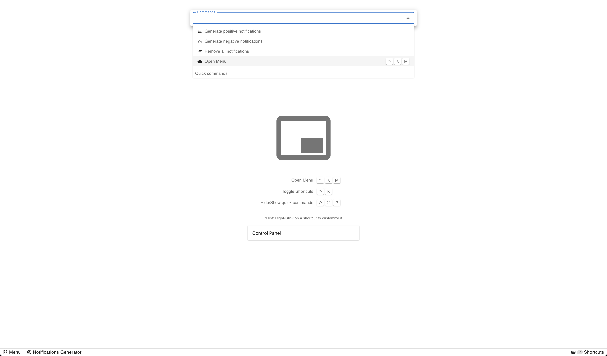

## Mui-Industrial sample web app



This is a sample web app that uses the Mui-Industrial React components.

It features sample panels, status bar elements, and a sample menu.

As well as commands and a sample snackbars

---

### Local run

Linking of the packages is done via regular symlinks.

For that, after ```npm install``` in the root folder, run: ```npm run link```.

_(This assumes the related project is also available in the parent folder)_


# 📑 mui-industrial

<br />


A zero-maintenance/batteries-included panel manager inspired by VSCode style/aspect that adds via Material-UI elements a self populating/managed and state keeping organization of generated children panels.

A root level ContextAPI driven provider that allows for the creation of status bars with a variety of elements that can be clicked or have a menu attached to them. The status bar is a self organizing manager that can be placed on either side of the screen and can be configured to even feature consoles and other elements.

---
## Dependencies expected (peerDependencies)

The library is built on top of the following dependencies:
 - **React && ReactDOM 17.0+**
 - **MUI 5.0+**
 - **MUI Icons-Material 5.0+**
 - **MUI Styles 5.0+**
 - **Emotion React 11.0+**
 - **Emotion Styled 11.0+**

 and related @types

 ## Package dependencies

  - **Re-Resizable 6.9.9+**
  - **React-Resizable 3.0.4**


## 🪄 Installation

Install the latest version with your favorite package manager.


```
npm install @rand0mC0d3r/mui-industrial --save
```

```
yarn i @rand0mC0d3r/mui-industrial
```

---
## 🎛️ Architecture & Structure

### 📑 - < IndustrialProvider >

The ```<IndustrialProvider>``` is a HOC Context driven manager, which we suggest to be added close the the root of the document, preferably outside the ±```<Router>``` but inside the ```<MuiTheme/MaterialUITheme>```

The **IndustrialProvider** constitutes of a wrapper around the **Context API** that acts as a store, with an API of methods exposed to the developer for managing it's elements, along with some internal methods that allow the elements to announce themselves, broadcast state changes and react to events. Communication is duplex and the elements themselves are in a dual-binding open chat with the **Provider**.

```
import { createTheme, ThemeOptions, ThemeProvider } from '@material-ui/core/styles'
...
import { IndustrialProvider } from 'mui-industrial'

export default (): JSX.Element => {
  const theme = useMemo(() => createTheme({ palette: { type: 'dark' } } as ThemeOptions), [])

  return <...>
    <ThemeProvider {...{ theme }}>
      <IndustrialProvider>

        {/* notification?... */}
        {/* login/modals/errors?... */}
        {/* ... */}

        <Router>
          {/* ... */}
        </Router>

        {/* ... */}
      </IndustrialProvider>
    </ThemeProvider>
  </...>
}
```

##### Available tweaks's

| Argument | Type |Default | Description |
|-----|----|----|--------|
| *allowRightClick* | boolean | ```false``` | Determines if the panel allows opening the default browser context menu on right click |
| *position* | string | ```left``` | A side option to define for a new user the preference of the menu. Options ```left``` and ```right``` |

---


## ```<MupStatus>``` - 📟 Status Bar Component

The component creates an object for the status bar that can be clicked. It's self registered and managed by the context provider provided by the library


**Hint**: Direct actions are permitted

<br />


**Hint**: As well placed menu actions
<br />


**Hint**: Informational sections

<br />


**Hint**: Errors are using the secondary color

---

Internally the wrapper ```<MupStatusBar>``` bound to the scene is not being rendered and started if there are no ```<MupStatus>``` announced across the application at any point in time. Later instantiation is fully encouraged to de-clutter the DOM.

Add a section to either ```primary``` or ```secondary``` side of the status bar. An omission will result in a default section.

Each ```MupStatus``` entity must contain an ```id``` in form of an unique identifier across the session.

#### # Inherited configuration

```<MuiPanelProvider />``` allows the user to configure the status bar with the following properties:

| Argument | Type | Default | Description |
|-----|--|--|---|
| allowRightClick | ```bool``` | _inherited_ | Decides if right/long click triggers any action |

#### # Available arguments


| Argument | | Type | Default | Description |
|-----|--|--|--|---|
|  id |⭐ | ```string``` | ... |  Give a unique identifier to the status element |
| elements | ⭐	| ```array```  | ```[]``` | List of objects of type ```{icon: ReactNode, text: string}```  |
| side |	| ```string``` | ```primary``` | Determines to which side the panel is bound |
| requestAttention |	| ```bool``` | ```false``` | When truthy is uses the ```secondary``` color |
| tooltip |	| ```string``` | ```''``` | Provides a tooltip acting as a guide |
| focusOnClick	| | ```string``` | _null_ | Toggles visibility of a panel known by ```<MuiPanelProvider>``` by it's unique identifier |
| onClick |	| ```func``` | ```() => {}``` | Issues callback when status section is clicked  |
| onContextMenu |	| ```func``` | ```() => {}``` | Issues callback when status section is right/long clicked.  |

#### Code sample


##### Simple example - static

```
// 2 icons with text
<MupStatus
  id="statusA"
  side="left"
  tooltip='33% frames left / Ready for photo'
  elements={[
    { icon: <FormatIndentIncrease color="action" />, text: 'Lorem' },
    { icon: <CameraIcon />, text: 'Ipsum' },
  ]}
/>

// 1 icon triggering a panel
<MupStatus
  id="triggerChromeCastPanel"
  side="left"
  focusOnClick='chromecastPanel'
  tooltip="Toggle visibility for panel"
  elements={[
  { icon: <CastConnectedIcon />, text: 'Toggle Panel' }
]}>
  demo text
</MupStatus>

// 1 icon doing an onClick callback
<MupStatus
  id='statusSimilarDocuments'
  onClick={handleClickOpen}
  tooltip="View Documents ... - (Last checked - 3 min ago)"
  elements={[{ icon: <AllInboxIcon />, text: '4 Related' }]}
/>

// 1 icon requesting attention, no text
<MupStatus
  id='statusSimilarDocuments'
  onClick={handleClickOpen}
  requestAttention
  tooltip="View Documents ... - (Last checked - 3 min ago)"
  elements={[{ icon: <AllInboxIcon /> }]}
/>
  ```

##### Dynamic example - updateable
```
  ...
  const [open, setOpen] = useState(false);
  const [elements, setElements] = useState();
  const [requestAttention, setRequestAttention] = useState(true);			// Request attention state

  const someFunction = () => {
   setElements([{ icon: <CloudDoneOutlinedIcon />, text: 'Document saved' }])		// Set an element
   setRequestAttention(true)								// Update attention state
  }

  ...

  return <>
    <MupStatus
      id='statusCustomElement'
      requestAttention={requestAttention}						// Reference attention state
      onClick={() => setOpen(true)}
      tooltip="Save Document?"
      elements={elements}								// Initialize empty (won't show)
    />
  ```


---
## ```<MupButton>``` - 🛎️ Button Component
#####  The component creates an 🏝️ ( + 📄 ) object that can be clicked. It's self registered and managed


**HINT**: Works great to display a logo or a button with a custom icon ( + text )

Allows the developer to add to the sidebars a logo, a logo with a custom short text, or a button triggering a custom action.


Internally the ```<MuiPanelProvider>``` is made aware of the ```<MupButton>``` instance after the **first render** which triggers the internal hook to upstream call the provider with a new entity.

#### # Available arguments


| Argument | Req | Observed | Type | Default | Description |
|-----|--|--|--|--|---|
| id |⭐ | |```string``` | ... |  Give a unique identifier to the status element |
| icon |⭐ | 👀  | ```node``` |  | Passthru element of Node type. Uses ```cloneElement``` internally |
| tooltip |	| 👀  | ```string``` |  | Provides a tooltip acting as a guide |
| shortText |	| 👀  | ```string``` |  | Provides a short text of max 4 UTF8 chars |
| showIcon |	| 👀  |```bool``` | ```true``` | Used to determine if the icon should be shown in case provided |
| disabled |	| 👀  |```bool``` | ```false``` | Determine if the colors turn gray and interactivity is disabled |
| onClick |	|  | ```func``` |  | Issues callback when status section is clicked  |

#### Code sample

##### Simple example - static

```
<MupButton
  id="appLogo"
  tooltip={`Click here to go ${page.url}`
  shortText="LKDN"                                                  // 4 letters will be displayed in all CAPS
  icon={<BathtubIcon style={{ color: 'orange' }}                    // custom color
  icon={<LinkedInIcon style={{ color: green[500] }} />}             // custom color
  icon={<SvgIcon component={StarIcon} viewBox="0 0 ..." />}         // raw svg icon
  icon={<Icon style={{ color: green[500] }}>add_circle</Icon>}      // font material icon
  icon={<Icon className="fa fa-plus-circle" color="secondary" />}   // font awesome icon
  showIcon={false}                                                  // hide icon
  disabled={true}                                                   // disable interaction
  onClick={() => console.log('clicked')}                            // callback
/>
  ```

##### Dynamic example - updateable
  ```
  export default ({ tooltip, shortText, icon, showIcon, disabled, ... }) => {

  return <>
    <MupButton
      { ... { tooltip, shortText, icon, showIcon, disabled } }
      id="appLogo"
      ...
    />
  </>
  ```


##### Available arguments


|  | Argument | Type | Default | Description |
|--|-----|--|--|---|
| ⭐ | children | ```Node``` | ... |  Passthru ```Node``` for the current app UI. Expecting the router output or the **main <...>** of the application. <br /><br />Consider to include all custom wrappers for **<Layout ...>**, **<Notifications ...>** and others.  |

#### Code sample


##### Simple example - static

```
 <MupContent>
  <...>
    <ReactRouter ... />                    // your app page/pages
  </...>
 </MupContent>
```

---
---
---
### TODO

- todo: make callbacks clean right the GC
